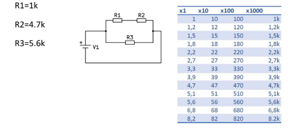
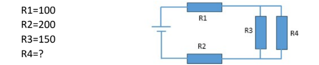
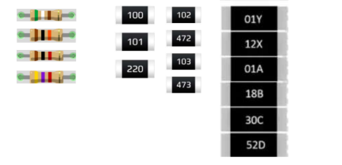

# Ejercicios

### 1. Calcular la resistencia equivalente de dos resistencias en paralelo de R1=1kOhm y R2=5kOhm.

- En serie: `1kOhm + 5kOhm = 6kOhm`
- En paralelo: 

Para calcular la resistencia equivalente (\( R_{eq} \)) de dos resistencias en paralelo, usamos la fórmula:

$$
\frac{1}{R_{eq}} = \frac{1}{R_1} + \frac{1}{R_2}
$$

Dado que:

- \( R_1 = 1k\Omega = 1000\Omega \)
- \( R_2 = 5k\Omega = 5000\Omega \)

#### Cálculo de la Resistencia Equivalente

Sustituyéndolos en la ecuación:

$$
\frac{1}{R_{eq}} = \frac{1}{1000} + \frac{1}{5000}
$$

$$
\frac{1}{R_{eq}} = \frac{5}{5000} + \frac{1}{5000} = \frac{6}{5000}
$$

$$
R_{eq} = \frac{5000}{6} \approx 833.33\Omega
$$

Por lo tanto, la resistencia equivalente es **833.33 Ω (o 0.833 kΩ)**.

Otra forma de expresar la resistencia equivalente en paralelo es usando la siguiente fórmula:

$$
R_{eq} = \frac{R_1 \cdot R_2}{R_1 + R_2}
$$

### a. Repetir el cálculo para R1=5kOhm y R2=5kOhm. ¿qué ha ocurrido con la resistencia equivalente?

- En serie: `10kOhm`
- En paralelo: `2.5kOhm`

### b. Repetir el cálculo para R1=5kOhm y R2=5MOhm. ¿qué ha ocurrido con la resistencia equivalente? ¿Qué consecuencias sacas con este resultado?

### 2. Calcular la resistencia equivalente del siguiente circuito, donde:

- Resistencia equivalente: `1/Rt = 1/5.6 + 1/5.7 -> Rt = 2.82kOhm`

### 3. Calcular la resistencia R4 para lograr una resistencia total de 405 Ohms

a) ¿El valor R4 encontrado es un valor estándar? Si no es así, buscar combinaciones
de resistencias estándares para conseguir R4 (figura 1)
b) ¿Qué colores tiene el código de 3 franjas de la resistencia R3? ¿y R1?

### 4. Identificar los valores nominales de las siguientes resistencias.

Parte de colores: 590 - 10k - 1k - 4,7k
