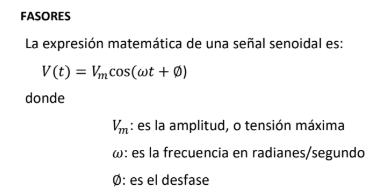
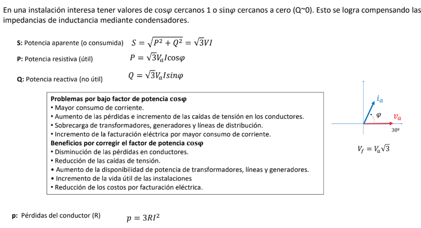

# Principios de electrónica
ISC(Clásicos) vs RISC(ARM) 
- Protocolos: MQTT -> IP/TCP -> Lora(utiliza su propio 'Gateway')
- Node_red: entorno de programación gratuito 

P (potencia) = V(voltaje) * I(intensidad)
## Transformadores
-> Los transformadores nos cambian el voltaje.

Entra una potencia pero hay que conocer la potencia útil, para saber la eficiencia del motor. Ya que siempre habrá perdidas.
## Amperio
Velocidad que tiene la 'electricidad'. Circulación de electrones por segundo.

A = 1C/s

Hay materiales aislantes y conductores.
```
CORRIENTE
V-    V+
  <--
```
## Magnitudes eléctricas
Cada resistencia, consume un poco de Tensión.
### Tensión
```
V (Voltios) = R(Ohm) * I(Amperios)
V = V1  - V2 = R*I
```
### Conexión en serie

`V = V1 + V2 + V3 + [...]`

Lo que cambia son las resistencias, la intensidad siempre se mantiene estable

### Conexión en serie

"Se incrementa la intensidad a medida que hay mas paralelos"

```
V1 - V2 (1/R1 + 1/R1)
```

### Resolución de circuitos eléctricos
Existen diferentes métodos para calcular los circuitos

```
I1 + I2 + I3 + I4 + [...] = 0
```

## Resistividad
Depende del material. 
La resistividad (𝜌) y la conductividad (𝜎) están relacionadas de manera inversa.

Lo suyo es que tenga mucha sección, pero poca longitud, asi tendrá poca `resistencia`, y por lo tanto, consumirá más.

## Condensador
Almacena de manera temporal la carga eléctrica. Solo funcionan con corriente alterna (se carregara el condensador y luego anulara la corriente).

R*C -> segundos
### Circuitos RC
Circuitos con Resistencia y Condensador

## Potencia
```
P (potencia) = V(voltaje) * I(intensidad) = R(resistencia) * I2(intensidad al cuadrado)
```
- Es la capacidad de dar energía en un tiempo(J/s)
- La unidad de potencia son los Watios (W)
- Caballos de potencia, se utiliza en motores: 1CV = 735498W
- En el sistema americano se utiliza HP: 1HP = 1,0138CV

Parte de la energía cinética se libera en forma de calor.
```
// Efecto Joule
Q = I2 * R * t
```
El seno esta desplazado 1/4 de un cos

- Hz: numero de porciones (periodo) en un segundo.

### Cosas importantes
- Va (Amplitud) -> Amplitud, es el pico de la onda
- Hz (frecuencia)
- Vpp (De punto a punto) -> Amplitud sumando la carga negativa y positiva
- Vef(Potencia eficaz) -> Potencia media promedio, el cual trabajan los dispositivos

```
Vef = Va / raiz-2
```

- Fase: desplazamiento entre dos frecuencias

_?Al conectar un aparato, nos variara la Amplitud y abra un desfase?_

**CORRIENTE ALTERNA**



_Potencia activa es la Vr, la potencia reactiva es la Vc (o el Voltage de condensación)._

### **Inductores vs. Condensadores**  

| Propiedad        | **Inductor (\(L\))**  | **Condensador (\(C\))**  |
|-----------------|----------------|----------------|
| **Almacena**    | Energía en un **campo magnético** | Energía en un **campo eléctrico** |
| **Reactancia (\(X\))** | \(X_L = 2\pi f L\) (aumenta con la frecuencia) | \(X_C = \frac{1}{2\pi f C}\) (disminuye con la frecuencia) |
| **Corriente en CA** | **Se retrasa** 90° respecto a la tensión | **Se adelanta** 90° respecto a la tensión |
| **Comportamiento en DC** | Actúa como un **corto circuito** (después de estabilizarse) | Actúa como un **circuito abierto** (bloquea la DC) |
| **Ejemplo de uso** | Filtros pasa-bajos, transformadores, supresión de picos de corriente | Filtros pasa-altos, almacenamiento de carga, estabilización de tensión |

💡 **En resumen:** Un inductor resiste cambios en la corriente, mientras que un condensador resiste cambios en la tensión. 🚀

## Trifásico


### Transformadores
Mantiene la frecuencia, disminuyendo o aumentando la Amplitud (tensión), y aumentando por consecuencia. La Potencia, si acaso disminuirá aunque idealmente muy poco.

## Esquemas eléctricos
IEC60617: Standard para elaborar los esquemas siguiendo la normativa.

## Protectores


| **Dispositivo**        | **Protege contra**                  | **Protección contra sobrecarga** | **Protección contra cortocircuito** | **Rearme**  | **Características adicionales**                 |
|------------------------|-------------------------------------|----------------------------------|-------------------------------------|-------------|--------------------------------------------------|
| **Relé térmico**        | Sobrecargas (por calor)             | Sí                               | No                                  | No          | Protege principalmente a motores eléctricos.     |
| **Magnetotérmico**      | Sobrecargas y cortocircuitos        | Sí                               | Sí                                  | Sí          | Combina protección térmica y magnética.           |
| **Diferencial**         | Fallos a tierra (fugas de corriente) | No                               | No                                  | Sí          | Detecta diferencias de corriente entre fase y neutro. |
| **Disyuntor**           | Sobrecargas y cortocircuitos        | Sí                               | Sí                                  | Sí          | Se puede resetear tras un disparo.               |
| **Fusible**             | Sobrecargas y cortocircuitos        | Sí                               | Sí                                  | No          | Se quema al sobrepasar un límite de corriente.    |

### Resumen:
- **Relé térmico**: Protege contra sobrecargas por temperatura, pero no contra cortocircuitos.
- **Magnetotérmico**: Protege tanto contra sobrecargas como cortocircuitos y es rearmable.
- **Diferencial**: No protege contra sobrecargas ni cortocircuitos, solo contra fugas de corriente a tierra.
- **Disyuntor**: Protege contra sobrecargas y cortocircuitos, y es rearmable.
- **Fusible**: Protege contra sobrecargas y cortocircuitos, pero no es rearmable y debe ser reemplazado.