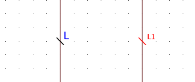
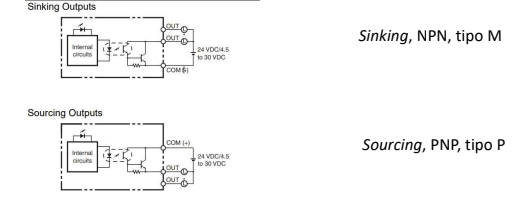

# EPLAN

## Important Shortcuts

- Para quitar la 'accion' que estemos haciendo (borrar, mover, etc..) apretamos `ESC`.

## Basics

### Referencias cruzadas

- Para cambiar el nombre de las referencias cruzadas: `Fichero` -> `Ajustes` -> (en la barra izquierda) `Proyectos` -> `<nombre_proyecto>` -> `General` -> `Tabla de espejo de contactos`

- Para mover la posicion de una referencia cruzada: '`Doble Click` en el referenciador' (bobina, etc..) -> En el menu, en la pestaña de arriba `Visualización` -> En el menu central de la derecha, `Posición` -> `Alinear automaticamente` -> Deseleccionar y ajustar al gusto

### Conexiones

- Para crear una entrada o salida de potencial(V), en `Insertar` (barra superior) -> `Cables/ conexiones` -> `Conexion`, apretamos la flecha para abrir el menu -> `Punto de conexion de potenciales`.

- Para indicar el 'numero' de cable: [...] -> `Conexion`, sin apretar la flecha.

#### No confundir
- No confundir `Conexión`, con `Punto de definición de potencial`. Aunque utilizan el mismo simbolo, al poner el ratón encima nos dira de que tipo es.
    - Para colocar un `Punto de definición de potencial`: [...] -> `Conexion`, apretamos la flecha para abrir el menu -> `Punto de definición de `.

### Divisiones
#### Potencial
     🧠 Normalmente utilizamos distintos colores para cada potencial (rojo, azul, etc..). Al cambiar un color hay que actualizar
#### Señal
     🧠❓ Es un conjunto del circuito el cual diferenciamos del resto
#### Redes
Subconjuntos dentro de una señal
#### Diferencias

- El de la izquierda es un punto de definicion de potencial
- El de la derecha es un punto de definicion de conexión
### Nombrar cables automaticamente
#### Potencial, señal (y redes)
Hay que tener muy clara la diferencia de potenciales (por actuadores que consumen - bombilla, rele, etc..), y de señal(punto donde puede o no haber el mismo potencial - apartir de un boton, logica etc).

### Navegadores
- Podemos incluir navegadores, para ello ir a `ver` -> `Abrir`(`navegadores`) -> Seleccionar el deseado.
- Una vez seleccionado, podemos agruparlo por tabs, arrastrando al 'navegador' (barra lateral), a la que deseemos.

### Apantallamiento

- **PRO-TIP:** Para poder juntar el apantallamiento con el cable de tierra, se ha de crear de **derecha a izquierda**.

## Estructura
### Introducción
Basado en **IEC 81346**
- Define las reglas para los sistemas de designacion de referencia(RDS).

El `IME completo` indica toda la estructura del proyecto. 

Por ejemplo para un IME: `=GAA+A1&EFS1-K1` -> nos indica que: Esta ubicado en 'el subgrupo' de funcion `GAA`, en 'el subgrupo' de localización `A1` y en 'el subgrupo' de tipo de documento `EFS1`

### Identificativo vs Descriptivo
    ❓🧠 A la hora de configurar la estructura, debemos indicar si es identificativo o descriptivo. Esto nos indicara si aparecera en el nombre de la pagina incluido(identificativo).
### Nomenclatura
Basado en [**IEC 61355**](https://en.wikipedia.org/wiki/IEC_61355)

- Se utiliza para clasificacion e identificacion de documentos

### Configurar estructura
- Para configurar la estructura iremos primero a `Fichero` -> `Estructura` -> `Páginas`, clickamos en los tres puntos `...` 
    - En este punto podemos ordenar nuestra estructura, utilizando los flechas
    - Tambien podemos marcar que partes tendra (no disponible, en caso de no uso)

- Para añadir nuevos grupos para cada tipo de nuestra estructura. Podemos ir a: `Herramientas`, en la barra superior -> `Identificador de estructura`

## Personalizacion de EPLAN
### Acceso rápido
Se puede añadir articulos a la barra de acceso rápido de dos formas:
- Haciendo click con el boton derecho en el elemento que queremos añadir, y indicando `Agregar a la barra de acceso rápido`
- Haciendo click en el boton derecho en la barra superior, `Personalizar barra de acceso rápido`
### Cinta
Se puede modificar la cinta (segundo nav superior), para añadir nuevas propiedades o eliminarlas, tambien se pueden añadir nuevas secciones dentro del nav y nuevos tab(ficha nueva). Para ello debemos hacer click derecho en el nav superior, `Personalizar cinta`

### PLCs
#### Introducción
Hay que tener muy claro las distintas tipos de PLCs.
- **Centralizadas**
    - **Compactas**
    - **Modulares**
- **Distribuidas**

Las compactas, tienen solo un IME `-U1`, el resto tienen varias.

#### Entradas NPN vs PNP
Depende que tipo de entrada tengamos, debemos poner el positivo en el COM o el negativo.
- Las salidas serán siempre de un tipo, no configurables.

##### NPN
- Q0.0 -> Bobina (rele, cosumidor, bombilla) -> 24V
- Tienen la referencia `T`
##### PNP
- Q0.0 -> Bobina -> 0V
- Tienen la referencia `T1`

#### 'Macro' input
Para cambiar el texto de la PLC, que corresponde a dicha entrada, hacemos click en la parte de `Spare` -> `Shift+[Doble-Click]` -> Esto nos abre un menu para modificar-lo