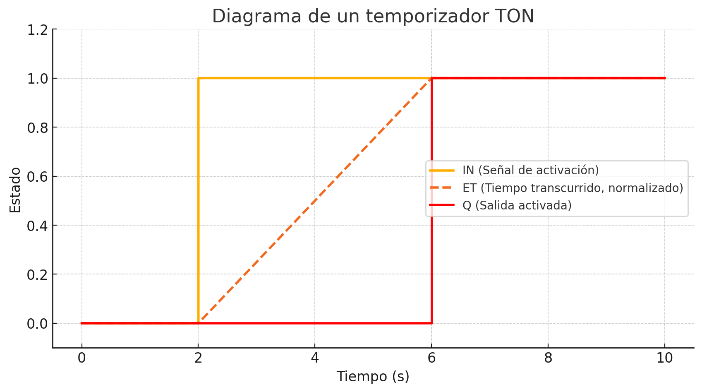
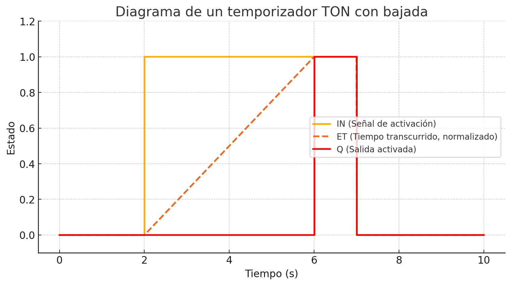

# Tia Portal Start

## Introducción
Base introductoria con ciertas claves extra para iniciar-se en Tia Portal.

## Utilización

### Programa 
#### Requisitos previos
_Utilizaremos el preset [Ejercicios_mando_alumnosV17](../../Documents/Downloads/Ejercicios_mando_alumnosV17.zip)_
#### Para iniciar la simulación de la PLC
- Click sobre la PLC en el menu de dispositivos. 
- En el menu superior, hazemos click a iniciar simulación. Esto nos abrira nuestro PLC SIM de Tia Portal
    - Nos pregunta si queremos sobreescribir, le decimos que si.
    - Nos pregunta para arrancar modulos. Cambiamos la opcion en el desplegable de `Ninguna acción` a `Arrancar módulo`
#### Para iniciar la simulación del HMI
- Click sobre el HMI en el menu de dispositivos.
- En el menu de superior, hazemos click a iniciar simulación, Esto nos abrira nuestro WinC RT Simulator de Tia Portal.
#### Iniciar conexión simulada
- Hacer click en `Establecer conexión online`. Para ello debe estar enchufada la PLC SIM.

### Bits
#### Set Reset
#### Flancos  
Se utiliza para detectar el cambio en un bit. 

**Genera un pulso que dura un scan**, permitiendo identificar transiciones de estado.
##### [**Flancos en profundidad**, con ejemplos practicos](./flancos.md)

### Módulos
#### Módulos SR y RS
La diferencia es cuando ambas instrucciones sean true, cual tendra preferencia. Siempre tiene preferencia el ultimo, osea en el `SR`, tendra preferencia el `Reset`

#### Módulos temporizadores
##### TON
_Ejemplo con 4s de `PT`_ 

    🧠 En el primer grafico podemos observar como una vez se activa la señal de activación, tarda el tiempo indicado `PT`, en activarse. La señal durara mientras la señal de entrada sea 1.

##### TOF
##### TP

#### Bits temporizados
- Hay que definir el bit que sea temporizado
- Para ello vamos a la configuracion de nuestra PLC -> `Marcas de sistema y de ciclo` -> `Bits de marcas de ciclo`, **se recomienda usar un bit lejano, _ej 600, 1000_**

#### Módulos contador
##### CTU
Contara en cada flanco de subida. `PV` nos indica el numero hasta el numero que va a contar. `R` es el numero en el que va a resetear, 

_si no hay o esta en false, no se reseteara pero parara de contar al llegar a `PV`._

`CV` es el resultado de nuestro contador.

##### CTD

##### CTUD

#### Módulos matematicos
Existen la mayoria de funciones matematicas del `math` de C.
#### Módulo `MOVE`
Asigna una variable.

### Importancia del ciclo de scan
#### [PDF Ejemplo desbordamiento de memoria](../../Documents/TiaPortal/ejemplo-flanco-necesario.pdf)

## Conexión a PLC física
### [Configuración workstation .90](../../Documents/TiaPortal/config-90.md)